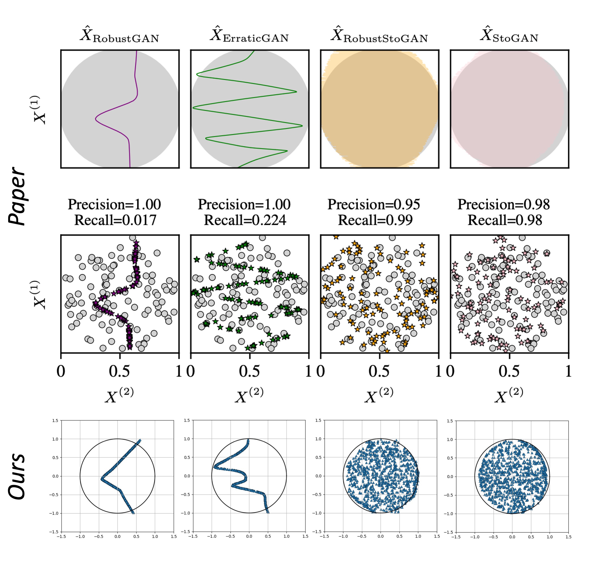

# Demo-Stochastic-VS-Deterministic
***Unofficial*** implementation of the demo in "_Reasons for the Superiority of Stochastic Estimators over Deterministic Ones: Robustness, Consistency and Perceptual Quality_".

```
@article{sto_vs_det,
  title={Reasons for the Superiority of Stochastic Estimators over Deterministic Ones: Robustness, Consistency and Perceptual Quality},
  author={Ohayon, Guy and Adrai, Theo and Elad, Michael and Michaeli, Tomer},
  journal={arXiv preprint arXiv:2211.08944},
  year={2022}
}
```



## Training, Inference, & Visualization

- ***Training***: `python train_gan.py --stochastic --robust`
- ***Inference***: `python infer_gan.py --stochastic --robust`
- ***Visualization***: `python vis_pred.py --stochastic --robust`

**Note**: _--stochastic --robust_ are optional. _--stochastic_ means using _stochastic_ algorithm, and _--robust_ means using *robust loss*. 

## Acknowledgement

We use some codes from [PyTorch-GAN](https://github.com/eriklindernoren/PyTorch-GAN). 
